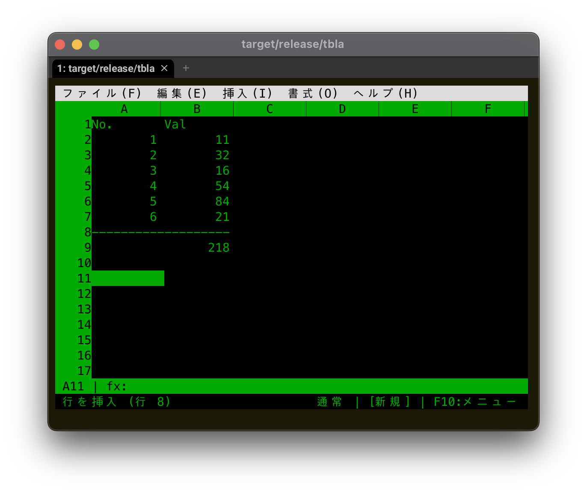

# tbla

一般的なキー操作・マウス操作で使えるターミナル表計算エディタ

[](https://opensource.org/licenses/MIT)
[](https://github.com/fukuyori/tbla/releases/latest)

[English](README.md) ｜ [📖 詳細ガイド](GUIDE_ja.md)



## 概要

tbla はターミナル上で動作する表計算エディタです。馴染みのあるキー操作
（矢印キー、Tab、Enter、Ctrl+C/V、Ctrl+S など）とマウス操作（クリック、
ドラッグ範囲選択、ホイールスクロール、右クリックメニュー）に対応し、
画面上部のメニューバーからファイル・編集操作にアクセスできます。

## 特徴

- **一般的なナビゲーション** — 矢印キー、Tab、Enter、Page Up/Down、Ctrl+Home/End
- **マウス対応** — クリック選択、ドラッグ範囲選択、ホイールスクロール、右クリックメニュー
- **メニューバー** — ファイル / 編集 / 挿入 / 書式 / ヘルプ（F10 またはクリック）
- **Excel 風ポイントモード** — 数式編集中に矢印/マウスでセル参照を直接ピック
- **数式エンジン** — 70以上の関数（SUM, VLOOKUP, IF, 日付, 財務, 三角, 統計 など）
- **絶対/相対参照** — $A$1, $A1, A$1, A1
- **数式の自動補正** — 行・列の挿入・削除時に参照を自動調整
- **コピー＆ペースト** — Ctrl+C / Ctrl+X / Ctrl+V（システムクリップボード連携）
- **Undo/Redo** — Ctrl+Z / Ctrl+Y
- **ファイル形式** — JSON（ネイティブ）、CSV/TSV、**Excel (.xlsx) 入出力**、**Parquet 入出力**
- **文字コード自動判定** — CSV / TSV / JSON 読み込み時に UTF-8 / UTF-8 BOM / UTF-16 / Shift-JIS / CP932 を自動判別。Excel から書き出した日本語 Windows の Shift-JIS CSV もそのまま開けます
- **URL から HTML テーブル取り込み** — `データ → URLから取り込み...` で Web ページの `<table>` を一覧表示し、プレビューから選んで取り込み（新規シート / 上書きを毎回確認）。ページの文字コードは `Content-Type` / `<meta>` から自動判定
- **SQL クエリ取り込み** — `データ → SQL から取り込み...` で PostgreSQL / MySQL / MariaDB / SQLite に SELECT を投げて結果をシートに読み込み。URI スキーム (`postgresql://` / `mysql://` / `sqlite:///`) で DB を自動振り分け
- **日本語/IME 対応** — 全角文字の正しい表示と、編集セル位置への IME 合成ウィンドウ表示。曖昧幅文字（①、○、→、─ など）は起動時にターミナルの実挙動を自動判定して幅を合わせます（環境変数 `TBLA_AMBIGUOUS_WIDE=1` / `0` で強制指定可能）

## インストール

### バイナリから

[GitHub Releases](https://github.com/fukuyori/tbla/releases/latest)から
最新版をダウンロードしてください。

### ソースから

```bash
git clone https://github.com/fukuyori/tbla.git
cd tbla
cargo build --release
```

バイナリは `target/release/tbla` に生成されます。

## クイックスタート

```bash
# 空のシートで起動
tbla

# 既存ファイルを開く
tbla data.json

# CSVファイルを開く
tbla data.csv
```

## キーバインド

### ナビゲーション

| キー | 動作 |
|------|------|
| `↑` `↓` `←` `→` | カーソル移動 |
| `Tab` / `Shift+Tab` | 右 / 左へ移動 |
| `Enter` / `Shift+Enter` | 下 / 上へ移動 |
| `Home` / `End` | 行頭 / データのある行末へ |
| `Page Up` / `Page Down` | 1 ページ上 / 下へ |
| `Ctrl+Home` | A1 へ移動 |
| `Ctrl+End` | データのある最終セルへ |
| `Ctrl+↑` `↓` `←` `→` | データ境界までジャンプ |
| `Ctrl+PgUp` / `Ctrl+PgDn` | 前 / 次のシートへ |
| `Shift+矢印` | 選択範囲を拡張 |
| `Ctrl+A` | 全選択 |
| `Ctrl+H` / `Ctrl+J` / `Ctrl+K` / `Ctrl+L` | 左 / 下 / 上 / 右（vim 風ホームポジション移動） |
| `Ctrl+Shift+H/J/K/L` | 同上 + 選択範囲を拡張 |

### 編集

| キー | 動作 |
|------|------|
| 任意の文字キー | 編集開始（上書き） |
| `F2` | 編集開始（既存内容を保持） |
| セルをダブルクリック | 編集開始（既存内容を保持） |
| `Enter` / `Tab` | 確定して次のセルへ |
| `↑` / `↓` | 確定して上下のセルへ |
| `Esc` | 編集をキャンセル |
| `Delete` / `Backspace` | セル/選択範囲をクリア（非編集時）／文字削除（編集中） |

### 編集中の文字カーソル移動

| キー | 動作 |
|------|------|
| `←` / `→` | 1文字戻る / 進む（※数式編集中はポイントモードに入る場合あり） |
| `Home` / `End` | 行頭 / 行末へ |
| `Ctrl+B` / `Ctrl+F` | 1文字戻る / 進む |
| `Ctrl+A` / `Ctrl+E` | 行頭 / 行末へ |
| `Backspace` | カーソル左の文字を削除 |
| `Delete` / `Ctrl+D` | カーソル位置の文字を削除 |
| `Ctrl+K` | カーソル位置から行末までを削除 |

### 集約関数の自動補完

`=SUM` `=AVG`（または `=AVERAGE`）`=MIN` `=MAX` `=COUNT` `=COUNTA` を
**引数なしで Enter** すると、隣接する数値範囲を自動検出して埋め込みます。

| 入力 | 隣接データ | 補完結果 |
|------|-----------|----------|
| `=sum` | A1:A3 に数値、カーソル A4 | `=SUM(A1:A3)` |
| `=avg` | 同上 | `=AVERAGE(A1:A3)` |
| `=max()` | B5:D5 に数値、カーソル E5（上が空） | `=MAX(B5:D5)` |
| `=min` | 隣接データなし | 補完せず、入力のまま |

**検出ルール:**
1. **上を優先**: 1 つ上のセルが数値なら、上方向に連続する数値ブロックを範囲化
2. **次に左**: 上が空なら、1 つ左のセルから左方向に連続する数値ブロックを範囲化
3. **両方ある場合は上を採用**
4. テキストや空セルで途切れたところで範囲が止まる
5. 単一セルなら `=SUM(A1)` 形式、複数セルなら `=SUM(A1:A3)` 形式
6. 数式セル（`=A1*2` など）も評価結果が数値なら範囲に含まれる

### 数式入力中のセル参照（ポイントモード）

Excel と同じく、数式編集中に `=`、`(`、`,`、演算子（`+` `-` `*` `/` `^` `&` `:` `<` `>`）の直後で
矢印キーやマウスを使うと、セル参照を直接ピックできます。

| 操作 | 動作 |
|------|------|
| `←` `→` `↑` `↓` | 参照先セルを 1 つ動かす（参照テキストが自動更新） |
| `Shift+矢印` | 参照範囲を拡張（例: `A1` → `A1:A3`） |
| セルをクリック | クリックしたセルを参照に挿入 |
| ドラッグ | 範囲を参照に挿入（例: `A1:C5`） |
| 任意の文字を入力 | ポイントモードを抜けて通常入力に戻る（参照は残る） |
| `Esc` | ポイントモードのみ抜ける（もう一度 `Esc` で編集キャンセル） |
| `Enter` / `Tab` | 入力を確定 |

ポイントモード中は、参照中のセルが**青色**でハイライト表示されます（範囲指定中は濃い青）。

### ファイル操作

| キー | 動作 |
|------|------|
| `Ctrl+N` | 新規 |
| `Ctrl+O` | 開く |
| `Ctrl+S` | 保存 |
| `Ctrl+Q` | 終了 |

### クリップボード

| キー | 動作 |
|------|------|
| `Ctrl+C` | コピー |
| `Ctrl+X` | 切り取り |
| `Ctrl+V` | 貼り付け |

### 検索・置換

| キー | 動作 |
|------|------|
| `Ctrl+F` | 検索 |
| `F3` | 次を検索 |
| `Ctrl+R` | 置換（Tab で検索/置換フィールドを切替） |
| `Ctrl+G` / `F5` | セル・名前付き範囲へジャンプ |

### メニュー

| キー | 動作 |
|------|------|
| `/` | メニューバーを開く（Lotus 1-2-3 スタイル、下記参照） |
| `F10` | メニューバーを開く（先頭メニューを展開） |
| `Alt+F` / `Alt+E` / ... | メニューをショートカットで開く |

**スラッシュメニュー（1-2-3 スタイル）**：通常モードで `/` を押すと
メニューバーに入り、選択中メニューのドロップダウンがプレビュー表示
されます。各項目に表示される頭文字キーだけで Enter 不要で降下できます。
例：`/D S` = データ → 並べ替え、`/F S` = 保存。トップメニューに無い
文字はプレビュー中の項目を直接実行します（`/N` = ファイル → 新規）。
`Esc` は 1 階層ずつ戻ります。セルの先頭に `/` そのものを入力したい
場合は `F2` で編集を開始してください。

### ファンクションキー

| キー | 動作 |
|------|------|
| `F2` | セルを編集 |
| `F3` | 次を検索 |
| `F4` | 数式編集中：カーソル位置の参照の `$` を循環（`A1` → `$A$1` → `A$1` → `$A1`。範囲は両端同時） |
| `F5` | セル・名前付き範囲へジャンプ |
| `F9` | 再計算（RAND / NOW などの揮発関数を更新） |
| `F10` | メニューバーを開く |

### 名前付き範囲

挿入 → 名前付き範囲を定義（`/I N`）でセル・範囲に名前を付けられます
（範囲欄は現在の選択から自動入力）。名前は

- 数式で使用：`=SUM(売上)`、`=税率*B2`（大文字小文字を区別せず、日本語可）
- ジャンプ先として使用：`Ctrl+G` / `F5` に名前を入力（範囲全体を選択し、
  必要ならシートも切替）

管理・削除は 挿入 → 名前付き範囲の管理（`/I M`）。名前は `.json` に
保存され、`.xlsx` の定義名とも相互変換されます。他シートを指す名前を
数式で使えるのは単一セルの場合のみです（クロスシート範囲はエンジンの
制限）。

## マウス操作

| 操作 | 動作 |
|------|------|
| セルを左クリック | カーソル移動 |
| セルからドラッグ | 範囲選択 |
| ホイール | 上下スクロール |
| 右クリック | コンテキストメニュー（切取/コピー/貼付/挿入/削除/列幅変更） |
| メニューバーをクリック | そのメニューを開く |
| 列ヘッダーの区切り `│` をドラッグ | 列幅を変更（Terminal.app は ⌥+ドラッグ） |

## ターミナル別の注意点

### macOS — Home/End/PgUp/PgDn キーがない Mac

Magic Keyboard など Home/End / PgUp/PgDn がない環境では **`Fn+矢印`** を使ってください。
OS レベルで標準キーに変換されるので追加設定なしで動きます。

| 押し方 | 送られるキー | 動作 |
|--------|--------------|------|
| `Fn+←` | Home | 行頭 |
| `Fn+→` | End | 行末 |
| `Fn+↑` | PgUp | 1 ページ上 |
| `Fn+↓` | PgDn | 1 ページ下 |
| `Fn+Ctrl+←` | Ctrl+Home | A1 へ移動 |
| `Fn+Ctrl+→` | Ctrl+End | データ最終セルへ |

### macOS — Terminal.app の入力制限

macOS 標準の Terminal.app には 2 つの既知の制限があります（iTerm2 / WezTerm / Alacritty /
kitty では問題なし）。

**1. `Shift+↑/↓` の SHIFT が落ちる**（左右は OK）

範囲選択の上下拡張ができません。次のいずれかで対応：

- **代替キー**: `Ctrl+Shift+K`（上）/ `Ctrl+Shift+J`（下）
- **Terminal.app 側で修正**: 設定 → プロファイル → キーボードタブ → `+`
  - キー `↑` / 修飾子 `Shift` / アクション `テキストを送信...` / 値 `\033[1;2A`
  - キー `↓` / 修飾子 `Shift` / アクション `テキストを送信...` / 値 `\033[1;2B`
- **別ターミナルを使う**

**2. マウスのクリック・ドラッグがプログラムに渡らない**（Moved だけ届く）

Terminal.app が自身のテキスト選択用にマウスボタンイベントを横取りするため、
列幅変更のドラッグなどが動きません。**⌥ (Option) を押しながらドラッグ**すると
プログラムに渡ります。

### macOS — `F1`〜`F12` がメディアキーになっている

`F2` での編集開始など、ファンクションキーが OS のメディアキー
（明るさ・音量）として横取りされる場合、**`Fn+F2`** を押すか、
システム設定 → キーボード → 「F1, F2 などのキーを標準のファンクションキーとして使用」を ON、
またはセルをダブルクリックで編集開始してください。

## メニュー構成

- **ファイル**: 新規 / 開く / 保存 / 名前を付けて保存 / CSVインポート・エクスポート / 印刷 (HTML) / 終了
- **編集**: 元に戻す / やり直し / 切り取り / コピー / 貼り付け / クリア / 全選択 / 検索 / 次を検索 / ジャンプ
- **挿入**: 行を挿入 / 列を挿入 / 行を削除 / 列を削除 / 名前付き範囲を定義… / 名前付き範囲の管理…
- **シート**: 新規シート / シート名変更 / シート削除 / 次のシート / 前のシート
- **データ**: 並べ替え… / フィルター… / フィルター解除 / … / 再計算
- **書式**: セルの書式設定… / 列幅を自動調整 / 列幅を広げる/狭める / 列幅を変更… / 太字・斜体・下線切替 / 左中央右揃え / 文字色 / 背景色 / 数値書式… / 書式クリア / 条件付き書式…
- **`:` キー**: WYSIWYG 書式メニュー（Lotus 1-2-3 流のカスケードポップアップ）— `:FB`=太字、`:FI`=斜体、`:FT3`=文字色を赤、`:CA`=列幅自動調整 のように頭文字キー数打で書式適用
- **ヘルプ**: キー操作一覧 / バージョン情報

## サポートされている関数

### 集計
`SUM`, `AVERAGE` (= `AVG`), `COUNT`, `COUNTA`, `MIN`, `MAX`

### 数学
`ABS`, `ROUND`, `ROUNDUP`, `ROUNDDOWN`, `CEILING`, `FLOOR`, `INT`, `MOD`, `POWER`, `SQRT`

### 三角・角度
`SIN`, `COS`, `TAN`, `ASIN`, `ACOS`, `ATAN`, `ATAN2`, `RADIANS`, `DEGREES`

### 対数・指数
`LN`, `LOG`, `LOG10`, `EXP`, `PI`

### 統計
`STDEV` (= `STDEV.S`), `VAR` (= `VAR.S`), `MEDIAN`, `MODE`

### 乱数・倍数
`RAND`, `RANDBETWEEN`, `GCD`, `LCM`, `FACT`

### 条件付き集計
`IF`, `SUMIF`, `COUNTIF`, `AVERAGEIF`, `SUMIFS`, `COUNTIFS`, `AVERAGEIFS`, `IFERROR`

### 日付・時刻
`TODAY`, `NOW`, `DATE`, `YEAR`, `MONTH`, `DAY`, `HOUR`, `MINUTE`, `SECOND`, `TIME`,
`WEEKDAY`, `WEEKNUM`, `DATEDIF`, `EDATE`, `EOMONTH`, `DAYS`

日付はシリアル値（1899-12-30 を 0 とする日数）で保持されます。`=DATE(2024, 1, 1)` のように
入力するとシリアル値が返り、`=YEAR(A1)` などで再分解できます。`NOW()` の小数部が時刻。

### 財務
`PMT`, `PV`, `FV`, `RATE`, `NPER`, `NPV`, `IRR`

Excel と同じキャッシュフロー符号規約：受取り = 正、支払い = 負。例：金利 5%（月複利）で
100,000 円を 30 年返済 → `=PMT(0.05/12, 360, 100000)` ≈ -536.82。

### 検索・参照
`VLOOKUP`, `HLOOKUP`, `INDEX`, `MATCH`

### 文字列
`LEFT`, `RIGHT`, `MID`, `LEN`, `TRIM`, `UPPER`, `LOWER`, `CONCATENATE` (= `CONCAT`)

### 論理
`AND`, `OR`, `NOT`

### 情報
`ISBLANK`, `ISNUMBER`, `ISTEXT`

## データ操作

### 並べ替え

`データ → 並べ替え...` で 3 つの入力欄が現れます：

| 欄 | 内容 |
|----|------|
| 並べ替え列 | 列名（既定はカーソル列） |
| 順序 | `asc`（昇順、既定）/ `desc`（降順） |
| ヘッダー行を含む | `y` でヘッダー行を固定（既定）、`n` で全体ソート |

数値は数値として、文字列は大文字小文字を無視して比較。空セルは昇順では末尾に。
**注意**: 数式セルは値で比較されますが、参照は移動後に書き換えられない（同一行内
の相対参照は維持される）ので、絶対行参照を含む式は要注意。

### フィルター

`データ → フィルター...` で対象列に条件を設定。マッチしない行を**非表示**にします。

| 条件記法 | 例 |
|----------|-----|
| 等値 | `100` または `=fruit` |
| 比較 | `>10` `<=100` `<>0` |
| 部分一致 | `*example*`（前後に `*`） |

`データ → フィルター解除` で全行を再表示。**ファイル保存時に自動解除**されます
（フィルター状態はセッション限定）。

### DataFrame ビュー（実験的）

`データ → DataFrame ビューに変換` でシートを Polars の型付き DataFrame として
扱えます。大量データの読込・型認識・分析に向きます。

| 操作 | 動作 |
|------|------|
| データ → DataFrame ビューに変換 | 1 行目をヘッダーとして読み、列ごとに型推論（Int64 / Float64 / Boolean / Utf8） |
| データ → セルビューに戻す | 元のセル表示に復元（cells は保持されているので無損失） |

- **編集可能**: 行 0 のセル編集は列名変更、データ行の編集は値の型保持で更新（パース失敗時は列全体が Utf8 に自動拡張）
- ステータスバーに行数・列数・型のサマリーが表示（例: `DF 1000×8 [Int64, Utf8, ...]`）
- ヘッダー行は太字・中央揃えで表示

**計算列**：`データ → 計算列を追加…` で派生列を追加できます。例：

| 列名 | 式 |
|------|-----|
| `revenue` | `price * qty` |
| `tax` | `revenue * 0.1`（先に追加した計算列も参照可能） |
| `grade` | `CASE WHEN score >= 80 THEN 'A' ELSE 'B' END` |

式は Polars の SQL エンジンで評価されるので、`CASE WHEN`、四則演算、関数（`ROUND`、`COALESCE` 等）が使えます。
`データ → 計算列をクリア` で全削除して元の状態に戻せます。

**直接 I/O**：
- **`.parquet`** ファイルは `File → Open` で直接 DataFrame ビューとして開く / `File → Parquet として保存` で書き出し
- **`ファイル → CSV を DataFrame として開く…`**：Polars の高速 CSV リーダーで巨大 CSV（10 MB / 数百万行）も瞬時に開く
- Parquet は Snappy 圧縮で CSV の約 1/10 サイズ

**分析操作**：DataFrame ビューで以下のメニュー：

| メニュー | 操作 | 例 |
|---------|------|-----|
| データ → SQL クエリ… | 任意の Polars SQL を `df` に対して実行 | `SELECT * FROM df WHERE price > 100` |
| データ → グループ集計… | 列でグループ化 + 集計を SQL に変換 | グループ列: `category` / 集計: `amount:sum, score:avg` |

集計関数: `sum / avg / min / max / count / stddev / var`。
SQL の結果はその場で DataFrame を置き換え、Ctrl+Z で元に戻せます。

将来的に：pivot、複数 DataFrame の join 等の分析操作を追加予定

### マルチシート

複数シートの管理：

| 操作 | 動作 |
|------|------|
| `Ctrl+PgDn` / `Ctrl+PgUp` | 次/前のシートへ |
| 画面下のタブをクリック | そのシートへ |
| `シート → 新規シート` | アクティブシートの直後に追加 |
| `シート → シート名変更...` | 現在のシート名を変更 |
| `シート → シート削除` | 現在のシートを削除（最後の 1 枚は削除不可） |

**クロスシート参照**：数式から他シートのセルを参照できます。

```
=Sheet2!A1          # Sheet2 の A1 を参照
=SUM(Sheet2!A1:A10) # Sheet2 の範囲を集計
='Sales 2024'!B5   # 名前にスペースがある場合は単引用符で囲む
```

実装上の制約：参照先のセルがさらに別シートを参照する**二段クロス参照は未対応**
（`#REF!` になります）。同一シート内の数式はもちろん深くネスト可能。

## セル書式 / 条件付き書式

### セル書式（手動）

選択範囲（または現在セル）に書式を適用：

| 操作 | 動作 |
|------|------|
| 書式 → セルの書式設定… | 数値書式・小数桁数・揃え・太字・文字色（パレット）・背景色（パレット）を 1 つのダイアログで一括設定。選択肢・色見本・OK/キャンセルボタンはマウスクリックで直接操作でき、キーボードでは `←`/`→` で選択肢切替、`Tab`/`↑`/`↓` で項目移動、小数桁数は数字キーで直接選択。右クリックメニューからも開けます |
| `Ctrl+B` | 太字 ON/OFF 切替 |
| `:` | WYSIWYG 書式メニュー（太字/斜体/下線/文字色/背景色/揃え/列幅などを頭文字キー数打で適用。例: `:FB` `:FT3`） |
| 書式 → 斜体 切替 / 下線 切替 | 斜体・下線の ON/OFF |
| 書式 → 左/中央/右揃え | アライメント変更（既定は数値=右・文字=左の自動） |
| 書式 → 文字色 / 背景色 | パレット（8色 + なし）をクリックか `←`/`→` で選択、または RGB 直接入力（`255,200,200` / `#fee` / `#ffeedd` 形式。入力時はパレットより優先、「なし」でクリア） |
| 書式 → 数値書式… | 種別（標準/数値/カンマ/通貨/%/指数/日付/日時/時刻/文字列 を `←`/`→` で選択）と小数桁数を指定 |
| 書式 → シートの既定書式… | シートの「標準」セル全部が継承する既定の数値書式（l123 の /Worksheet Global Format 相当） |
| 負数の表示 | 赤 / 括弧 `(123)` / 括弧+赤（セルの書式設定ダイアログの「負数」行、または `:FN`） |
| 書式タグ | 数式バーに現在セルの書式を `(C2)`（通貨2桁）のような l123 流タグで常時表示 |
| 書式 → 書式クリア | アライメント・太字・色・数値書式を全て既定に戻す |

書式は **値編集後も保持** されます。`100` のセルに書式を付けて `200` に上書きしても、太字や色は残ります。

### 条件付き書式

セルの値に応じて自動的に色付けするルールを登録します。

`書式 → 条件付き書式…` で 3 つの入力欄：

| 欄 | 例 |
|----|-----|
| 対象範囲 | `B2:B100`、単一セル `A1` も可 |
| 条件 | `>100` / `<=0` / `=42` / `<>0` または `scale:0-100` |
| 背景色 | `255,200,200` または `#fee` |

**カラースケール**：`scale:0-100,255,255,255,220,50,50` のように `scale:min-max,minR,minG,minB,maxR,maxG,maxB` （色省略時は明るい→赤のデフォルト）。値に応じて 2 色間をグラデーション補間。

`書式 → 条件付き書式 全クリア` でルールを全削除。

### ファイル保存

- **JSON ネイティブ**：セル書式（色・太字・揃え・数値書式）と条件付き書式（範囲・条件・色）を保存・復元
- **xlsx 書き出し**：`rust_xlsxwriter::Format` で書式を、`ConditionalFormat*` でルールを書き出すので、Excel/LibreOffice で開いても同じ見た目になります
- **xlsx 読み込み**：背景色・文字色・水平揃え・太字・斜体・下線を取り込み（`xl/styles.xml` を直接パース）。**条件付き書式（cellIs 比較、colorScale、dataBar）も読み込み対応** — Excel/LibreOffice で作った書式付き / 条件付き書式付きのファイルがそのまま色付きで開けます。罫線・テーマ色は現状未対応

## 印刷

ターミナル上に直接印刷するのではなく、**印刷用 HTML をエクスポートしてブラウザで開く**方式です。
ブラウザの印刷ダイアログ（Cmd/Ctrl+P）から余白・ページ番号・PDF 保存・縮小印刷など好きに設定できます。

- `Ctrl+P` または `ファイル` → `印刷 (HTML)...`
- 出力先ファイル名（既定はシート名 .html）を入力 → Enter
- 自動的に既定ブラウザで開きます（macOS: `open`、Linux: `xdg-open`、Windows: `start`）
- 自動で開けない環境では、出力された HTML をブラウザにドロップすれば OK

スタイル：
- 列ヘッダー（A, B, C...）と行番号は印刷の各ページで自動的に繰り返し
- 数値は右揃え、文字列は左揃え、エラーは赤
- 罫線・等幅数字付き、ブラウザ依存なし（CSS インライン埋め込み）

## 計算の規約

### 浮動小数点の比較（相対誤差）

数値の `=` `<>` `>` `<` `>=` `<=`、および `SUMIF` / `COUNTIF` / `*IFS` の条件、
`VLOOKUP` / `MATCH` の完全一致は **約 15 桁の相対誤差** で等価判定します。

具体例：
```
=(0.1+0.2)=0.3            → TRUE  （生の f64 だと 0.30000000000000004）
=(0.1+0.2)>=0.3           → TRUE  （境界は等価扱い）
=(0.1+0.2)>0.3            → FALSE （厳密 > は等価範囲を除外）
=COUNTIF(A1, ">=0.3")     → 1     （A1=`=0.1+0.2` のとき）
```

許容誤差は `max(|a|, |b|, 1.0) * 1e-12` — 大きな数でもスケールに比例。
3 桁分の演算誤差まで吸収するため、数段ネストした数式でも安全です。

### 日付シリアル値（Power BI 規約）

`DATE` / `TODAY` / `NOW` などは「**1899-12-30 を 0 とする日数**」のシリアル値を返します。

| 日付 | シリアル | vs Excel |
|------|----------|----------|
| 1899-12-30 | 0 | n/a |
| 1900-01-01 | 2 | Excel: 1（1 ズレ） |
| 1900-02-28 | 60 | Excel: 59（1 ズレ） |
| 1900-03-01 | 61 | **一致** |
| 2024-01-01 | 45292 | **一致** |

1900-03-01 以降は Excel と完全一致。1900 年 1-2 月だけ 1 ズレるのは Excel が
存在しない 1900-02-29 を計算に含めるバグを抱えているため。tbla は Power BI と同じく
**この閏年バグを修正済み**（純粋なグレゴリオ暦）です。WEEKDAY も実暦どおり。

## ファイル形式

### ネイティブ形式（JSON）

tbla は JSON をネイティブ形式として使用し、以下を保存します。

- セルの値と数式
- 列幅
- シート名

```json
{
  "version": "1.0",
  "name": "Sheet1",
  "cells": {
    "A1": "こんにちは",
    "B1": "=SUM(A2:A10)"
  },
  "col_widths": {
    "A": 15
  }
}
```

### CSV/TSV

- インポート: ファイル → CSVインポート (`Alt+F`, `I`)
- エクスポート: ファイル → CSVエクスポート (`Alt+F`, `E`)
- システムクリップボードは TSV 形式を使用

### Excel (.xlsx)

`ファイル → 開く / 名前を付けて保存` で拡張子 `.xlsx` / `.xlsm` を渡せば自動的に Excel 形式として処理されます。

**読み込み**:
- セル値（文字列・数値・真偽値・エラー）
- 数式（`=SUM(...)` 等を保持。tbla のエンジンで再評価）
- マルチシートのブックは **最初のシートだけ** 読み込み、他シート名はステータスバーに警告

**書き出し**:
- セル値・数式（`=SUM(...)` 形式で書き出し、Excel が開く時に再計算）
- 列幅
- tbla で評価した結果をキャッシュ値として埋め込むので、再計算しないビューアでも値が見える

**フォールバック**: tbla が未対応の Excel 関数（`BITAND` など）を含む数式は、Excel が
保存していた最後の計算結果を表示・集計値として使用します。セル編集で上書きされます。

## ライセンス

MITライセンス。詳細は [LICENSE](LICENSE) を参照してください。

## 作者

[@fukuyori](https://github.com/fukuyori)
